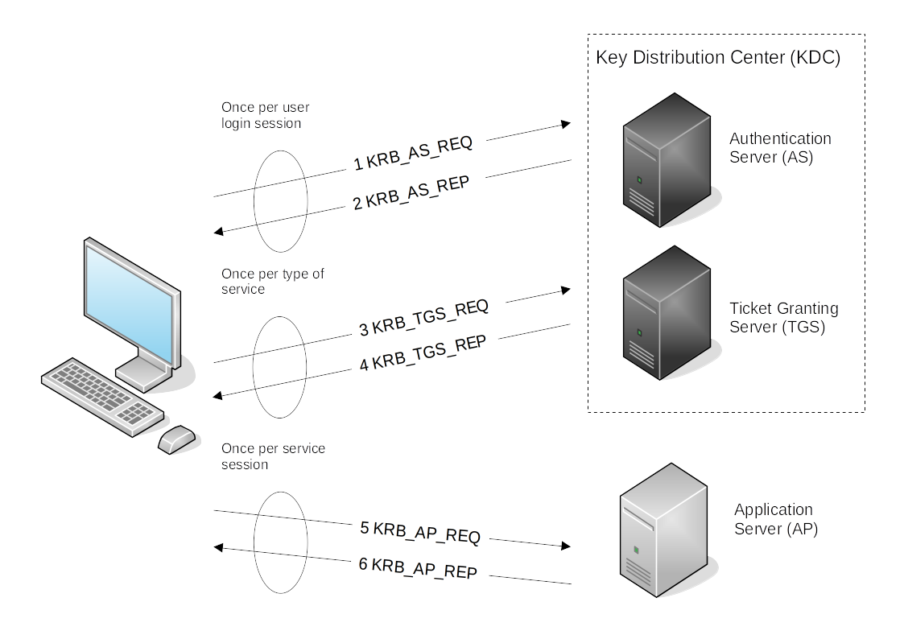

# Kerberos authentication

The Kerberos protocol is not a Microsoft invention, but Microsoft integrated their version of Kerberos in Windows2000, 
and it is now replacing NT Lan Manager (NTLM), which was a challenge-response authentication protocol.

Kerberos uses stronger encryption, which improves the security as compared to NTLM. 

## Transport layer

Kerberos uses UDP or TCP as transport protocol, which sends data in cleartext. Kerberos is responsible for providing 
encryption. Ports used by Kerberos are UDP/88 and TCP/88.

## Agents

The agents working together to provide authentication in Kerberos:

* Client or user who wants to access to the service.
* Application Server (AP) which offers the service required by the user.
* Key Distribution Center (KDC), responsible for issuing the tickets, installed on the Domain Controller (DC). It is 
supported by the Authentication Service (AS), which issues the TGTs.

## Encryption keys

There are several tickets. Many of those structures are encrypted or signed in order to prevent being tampered by 
third parties. 

* KDC or krbtgt key, which is derived from the krbtgt account NTLM hash.
* User key, derived from user NTLM hash.
* Service key, derived from the NTLM hash of the service owner, which can be a user or computer account.
* Session key, which is negotiated between the user and KDC.
* Service session key to be used between user and service.

## Tickets

Tickets are delivered to users for enabling actions in the Kerberos realm:

* The Ticket Granting Service (TGS) is the ticket for authenticating with a service. It is encrypted with the service 
key.
* The Ticket Granting Ticket (TGT) is the ticket presented to the KDC to request a TGSs. It is encrypted with the KDC 
key.

## PAC

The Privilege Attribute Certificate (PAC) is included in almost every ticket. It contains the privileges of the user 
and is signed with the KDC key. Services can verify the PAC by communicating with the KDC (does not happen often) by 
checking its signature. What is not verified is whether privileges inside the PAC are correct. And a client can avoid 
the inclusion of the PAC inside the ticket by specifying it in the `KERB-PA-PAC-REQUEST` field of the ticket request.

## Messages

1. KRB-AS-REQ - The client requests an Authentication Ticket or Ticket Granting Ticket (TGT).
2. KRB-AS-REP - The Key Distribution Center verifies the client and sends back an encrypted TGT.
3. KRB-TGS-REQ - The client sends the encrypted TGT to the Ticket Granting Server (TGS) with the Service Principal 
Name (SPN) of the service the client wants to access. 
4. KRB-TGS-REP - The Key Distribution Center (KDC) verifies the TGT of the user and that the user has access to the 
service, then sends a valid session key for the service to the client. 
5. KRB-AP-REQ - The client requests the service and sends the valid session key to prove the user has access. 
6. KRB-AP-REP - The service grants access

## Kerberos tickets overview 

The main ticket that you will see is a ticket-granting ticket. These can come in various forms such as a `.kirbi` 
for Rubeus, `.ccache` for Impacket. A ticket is typically base64 encoded and can be used for various attacks. 

* A normal TGT will only work with the given service.
* A KRBTGT allows for getting any service ticket, in turn allowing access to anything on the domain.

## Attack privilege requirements

* Kerbrute Enumeration - No domain access required 
* Pass the Ticket - Access as a user to the domain required
* Kerberoasting - Access as any user required
* AS-REP Roasting - Access as any user required
* Silver Ticket - Service hash required 
* Golden Ticket - Full domain compromise (domain admin) required
* Skeleton Key - Full domain compromise (domain admin) required