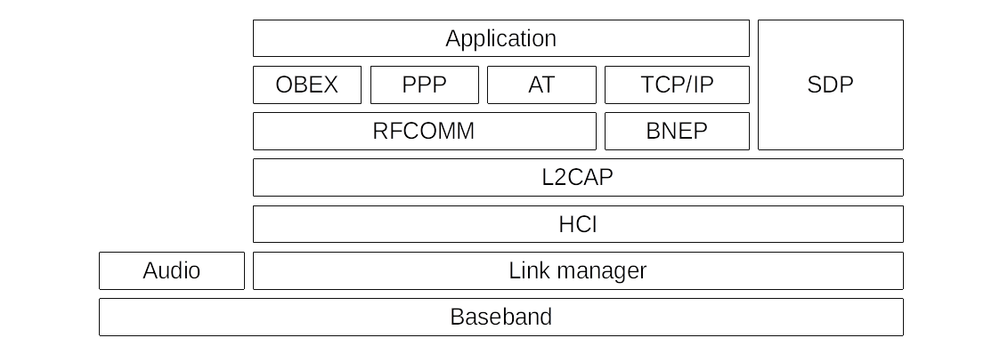
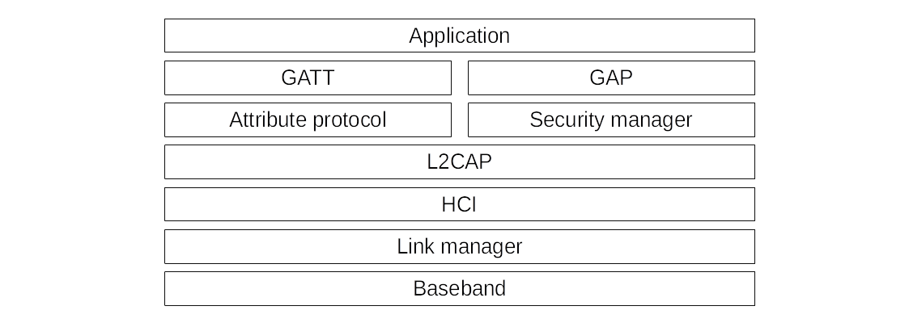

# Protocol stacks

Bluetooth is a wireless voice and data transmission technology, which can be found in
mobile phones, PDAs, USB sticks, keyboards, mices, headsets, printers, telephone facilities in cars, 
navigation systems, new modern advertisement posters, umbrellas, washing machines, cat litter trays,
fragrance dispensers, deodorant sticks, toilets, salt shakers, you name it.

## Classic Bluetooth protocol stack

* The baseband is built by the radio interface. It operates on the 2.4 GHz ISM band (2400–
2483.5 MHz) with a signal strength of 1 mW–100 mW and a range of 1–100 m. With the right
antenna you can extend the range up to a mile. The baseband is divided into 79 channels and switches frequency 
1600 times per second. This is called Frequency-Hopping; it increases the robustness against interferences and 
makes sniffing more difficult.
* The Link Manager Protocol (LMP), can be compared with Ethernet and implements a 48-bit long Bluetooth source and 
destination address that consists of three parts NAP, UAP and LAP. As with MAC addresses the 
first three byte are vendor specific. LMP is also responsible for the link setup, authentication and 
encryption and the pairing process (negotiate a long term key used to derive session keys). It is implemented in the 
firmware of the Bluetooth hardware and knows 4 different security modes:
  1. No encryption, no authentication
  2. Individual traffic is verschlüsselt, Broadcast traffic is not, no authentication
  3. All traffic is encrypted and authenticated
  4. All traffic is encrypted and authenticated and uses Secure Simple Pairing (SSP, introduced
  in Bluetooth 2.1)
* The Host Control Interface (HCI) implements an interface to the Bluetooth firmware. It is used to send L2CAP 
packets to the Link Manager in the firmware, to read features of the hardware and to change its configuration. 
It is the lowest layer that is implemented in the OS. The communication is packet- and connection-oriented.
* The Logical Link Control and Adaptation Protocol (L2CAP) is comparable to IP, and responsible for the 
fragmentation of data, group management and to implement higher layered protocols like RFCOMM, SDP or BNEP.
* RFCOMM simulates a serial line and is not only useful to access serial devices such as
modems in mobile phones. Higher layer protocols like OBEX depend on it. It is similar
to TCP, as it implements channels for different applications. Via channels, programs (in Bluetooth called profiles) 
can be accessed. In total there are 30 channels.
* The Bluetooth Network Encapsulation Protocol (BNEP) encapsulates IPv4-, IPv6- or IPX- packets and tunnels it 
over TCP/IP. On Linux this is realized with pand. BNEP builds on L2CAP.
* The Service Discovery Protocol (SDP) can be used to query the services of a remote device. Services must be 
registered to be listed. SDP builds on L2CAP.
* OBject EXchange (OBEX) was invented to transfer objects. Differentiate between the OBEX-Push- and OBEX-Ftp-profile. 
OBEX-Push is commonly used for instant ad-hoc data transfer like sending vcards. OBEX-Ftp is more like FTP, to sync 
whole directory structures. There are other OBEX based profiles. OBEX builds on top of RFCOMM.

##  BLE – Bluetooth Low Energy

Since Version 4.0 there is another protocol stack called Bluetooth Low Energy (BLE) historically also named Bluetooth 
Smart. Originally it was invented for IoT devices, which have small battery capacity and only want to exchange data 
from time to time over a low distance like fitness trackers, medical devices, sensors and so on. Every smartphone and
Bluetooth chip in laptops have BLE included.

* The Generic Access Profile (GAP), defines new roles for communication: Peripheral (sends
advertisements and is connectable), Central (scans for advertisements and connects to a peripheral), 
Broadcaster (also sends out advertisements, but is not connectable), and last but not least, 
Observer (receives advertisements, but cannot initiate a connection). Peripherals and Broadcaster are sometimes 
also called Beacons. Peripherals can implement a whitelist of addresses of Bluetooth devices allowed to find them 
in a discovery scan and to connect to them. This can be circumvented by a hardware Bluetooth sniffer
like Ubertooth and Address-Spoofing.
* the Generic Attribute Profile (GATT), builds on the ATT protocol and is used to read and write values. 
It implements them in a hierarchy of different services with a number of characteristics. Beside reading and 
writing data GATT can also be used to send commands as well as notifications and indications of data it manages. 
Indication and notification packets are used to inform about new or updated data. Indication packets must
be acknowledged by the client.

BLE devices typically do not have enough computing power to do encryption. If encryption is
in use often a hard coded pin such as 0000 or 1234 is used due to the lack of a keyboard.
The spec also defines the possibility to generate a random pin during the pairing process.
Another option of many BLE devices is using bonding. It means paired devices store the
key and use them for later communication.
