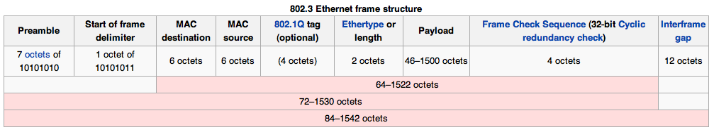
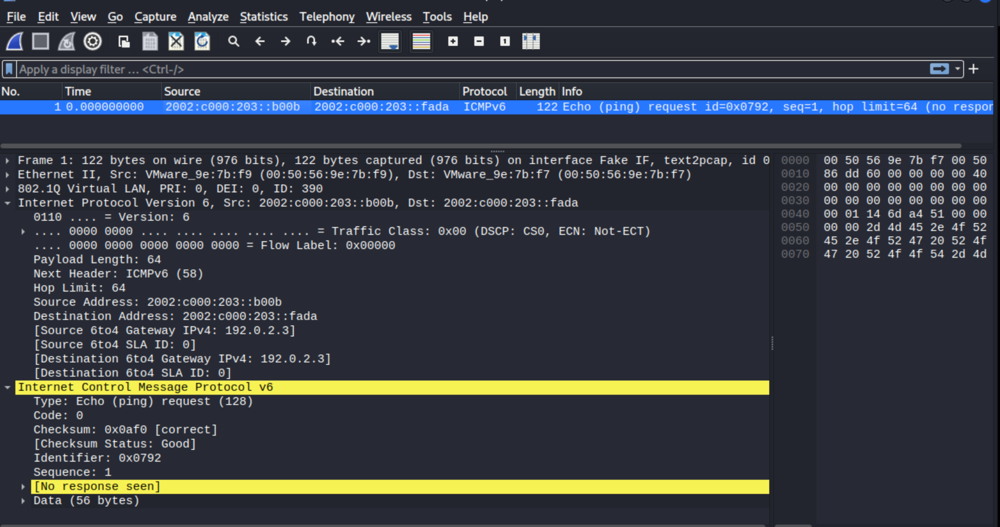
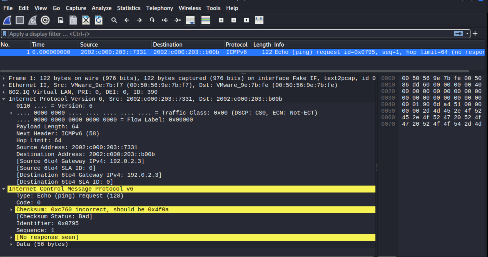
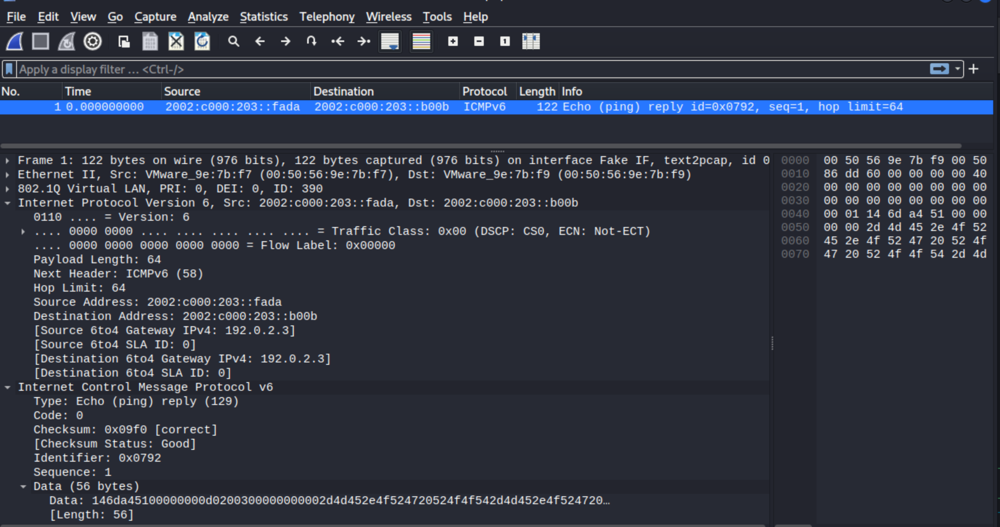

# ETHERNET patched transmission

[root-me challenge ETHERNET - Patched transmission](https://www.root-me.org/en/Challenges/Network/ETHERNET-Patched-transmission): These frames have been altered upon interception, find the lost information.

Password’s format is 10 bytes in hexadecimal notation (i.e. 20 characters)

----



## First packet

```text
>>> INGRESS >>>
        0x0000:  0050 569e 7bf9 0050 569e 7bfb 8100 0185  
        0x0010:  86dd 6000 0000 0040 3a40 2002 c000 0203  
        0x0020:  0000 0000 0000 0000 7331 2002 c000 0203  
        0x0030:  0000 0000 0000 0000 dead 8000 0af0 0792  
        0x0040:  0001 146d a451 0000 0000 d020 0300 0000  
        0x0050:  0000 2d4d 452e 4f52 4720 524f 4f54 2d4d  
        0x0060:  452e 4f52 4720 524f 4f54 2d4d 452e 4f52  
        0x0070:  4720 524f 4f54 2d4d 452e
```

| Field                          | Value              |
|:-------------------------------|:-------------------|
| MAC destination (6 octets)     | 00 50 56 9e 7b f9  |
| MAC source (6 octets)          | 00 50 56 9e 7b fb  |
| 802.1Q TAG (VLAN) (4 octets)   | 81 00 01 85        |
| Ethertype or length (2 octets) | 86 dd (IPv6 frame) |

Using [text2pcap](https://www.wireshark.org/docs/man-pages/text2pcap.html):


## Second packet

```text
>>> INGRESS >>>
        0x0000:  0050 569e 7bf7 0050 569e 7bf9 8100 0186  
        0x0010:  86dd 6000 0000 0040 3a40 2002 c000 0203  
        0x0020:  0000 0000 0000 0000 b00b 2002 c000 0203  
        0x0030:  0000 0000 0000 0000 fada 8000 0af0 0792  
        0x0040:  0001 146d a451 0000 0000 d020 0300 0000  
        0x0050:  0000 2d4d 452e 4f52 4720 524f 4f54 2d4d  
        0x0060:  452e 4f52 4720 524f 4f54 2d4d 452e 4f52  
        0x0070:  4720 524f 4f54 2d4d 452e
```

| Field                          | Value              |
|:-------------------------------|:-------------------|
| MAC destination (6 octets)     | 00 50 56 9e 7b f7  |
| MAC source (6 octets)          | 00 50 56 9e 7b f9  |
| 802.1Q TAG (VLAN) (4 octets)   | 81 00 01 86        |
| Ethertype or length (2 octets) | 86 dd (IPv6 frame) |

Using [text2pcap](https://www.wireshark.org/docs/man-pages/text2pcap.html):



## Third packet

```text
>>> INGRESS >>>
        0x0000:  0050 569e 7bfe 0050 569e 7bf7 8100 0186  
        0x0010:  86dd 6000 0000 0040 3a40 2002 c000 0203  
        0x0020:  0000 0000 0000 0000 7331 2002 c000 0203  
        0x0030:  0000 0000 0000 0000 b00b 8000 c760 0795  
        0x0040:  0001 906d a451 0000 0000 8fac 0b00 0000  
        0x0050:  0000 2d4d 452e 4f52 4720 524f 4f54 2d4d  
        0x0060:  452e 4f52 4720 524f 4f54 2d4d 452e 4f52  
        0x0070:  4720 524f 4f54 2d4d 452e
```

| Field                          | Value              |
|:-------------------------------|:-------------------|
| MAC destination (6 octets)     | 00 50 56 9e 7b fe  |
| MAC source (6 octets)          | 00 50 56 9e 7b f7  |
| 802.1Q TAG (VLAN) (4 octets)   | 81 00 01 86        |
| Ethertype or length (2 octets) | 86 dd (IPv6 frame) |

Using [text2pcap](https://www.wireshark.org/docs/man-pages/text2pcap.html):



## Fourth packet

```text
<<< EGRESS <<<
        0x0000:  0050 569e 7b?? 0050 569e 7b?? ???? 0186  
        0x0010:  86dd 6000 0000 0040 ??40 2002 c000 0203  
        0x0020:  0000 0000 0000 0000 ???? 2002 c000 0203  
        0x0030:  0000 0000 0000 0000 ???? ??00 09f0 0792 
        0x0040:  0001 146d a451 0000 0000 d020 0300 0000  
        0x0050:  0000 2d4d 452e 4f52 4720 524f 4f54 2d4d  
        0x0060:  452e 4f52 4720 524f 4f54 2d4d 452e 4f52  
        0x0070:  4720 524f 4f54 2d4d 452e  
```

| Field                          | Value              |
|:-------------------------------|:-------------------|
| MAC destination (6 octets)     | 00 50 56 9e 7b ??  |
| MAC source (6 octets)          | 00 50 56 9e 7b ??  |
| 802.1Q TAG (VLAN) (4 octets)   | ?? ?? 01 86        |
| Ethertype or length (2 octets) | 86 dd (IPv6 frame) |

First and third packet have incorrect checksums, so this could be a reply to the second (on the same VLAN):

| Field                          | Value              |
|:-------------------------------|:-------------------|
| MAC destination (6 octets)     | 00 50 56 9e 7b f9  |
| MAC source (6 octets)          | 00 50 56 9e 7b f7  |
| 802.1Q TAG (VLAN) (4 octets)   | 81 00 01 86        |
| Ethertype or length (2 octets) | 86 dd (IPv6 frame) |

Making for:

| Field            | Value                   | Missing |
|:-----------------|:------------------------|:--------|
| ICMPv6 Packet    | 3a                      | 3a      |
| IPv6 source      | 2002 c000 0203 ... fada | fada    |
| IPv6 destination | 2002 c000 0203 ... b00b | b00b    |
| ICMP-Type        | 0x81 (echo-reply)       | 81      |

```text
0000 00 50 56 9e 7b f9 00 50 56 9e 7b f7 81 00 01 86  
0010 86 dd 60 00 00 00 00 40 3a 40 20 02 c0 00 02 03  
0020 00 00 00 00 00 00 00 00 fa da 20 02 c0 00 02 03  
0030 00 00 00 00 00 00 00 00 b0 0b 81 00 09 f0 07 92 
0040 00 01 14 6d a4 51 00 00 00 00 d0 20 03 00 00 00  
0050 00 00 2d 4d 45 2e 4f 52 47 20 52 4f 4f 54 2d 4d  
0060 45 2e 4f 52 47 20 52 4f 4f 54 2d 4d 45 2e 4f 52  
0070 47 20 52 4f 4f 54 2d 4d 45 2e
```

Using [text2pcap](https://www.wireshark.org/docs/man-pages/text2pcap.html), and fits!



Concatenate the missing info just filled in to get the flag.

----

## Resources

* [Format des trames Ethernet](https://repository.root-me.org/R%C3%A9seau/FR%20-%20Format%20des%20trames%20Ethernet.pdf)
* [Les réseaux Ethernet - le format des trames](https://repository.root-me.org/R%C3%A9seau/FR%20-%20Les%20r%C3%A9seaux%20Ethernet%20-%20le%20format%20des%20trames.pdf)
