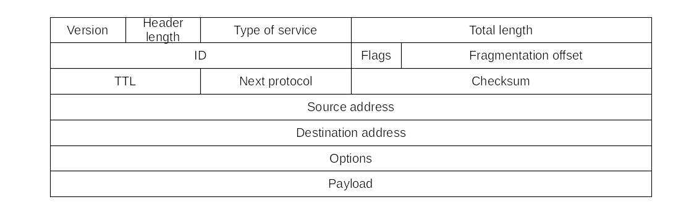

# Introduction

## What?

Hacking the heart of the Internet.

## Why?

* Despite attempts to make TCP as secure as possible, there still are some attacks that abuse it.
* Three major attacks are possible: Address spoofing, TCP sequence number prediction, and port scanning.
* And several minor attacks.

## How?

* [Sniffing](sniffing.md)
* [Reading and writing PCAP dump files](PCAP-dumps.md)
* [Password sniffer](password-sniffer.md)
* [Sniffer detection](sniffer-detection.md)
* [IP-Spoofing](IP-spoofing.md)
* [SYN-flooder](SYN-flooder.md)
* [Denial of Service (DoS)](DoS.md)
* [Distributed Denial of Service (DDoS)](DDoS.md)
* [Distributed Deflection Denial of Service (DrDoS)](DrDoS.md)
* [Port scanning](port-scanning.md)
* [Port-scan detection](port-scan-detection.md)
* [ICMP redirection](ICMP-redirection.md)
* [RST daemon](RST-daemon.md)
* [Replay attack](Replay-attack.md)
* [TCP sequence number prediction attack](TCP-SNP.md)
* [Hijack session (network)](Hijack-network-session.md)
* [SSL hijacking](SSL-hijacking.md)

