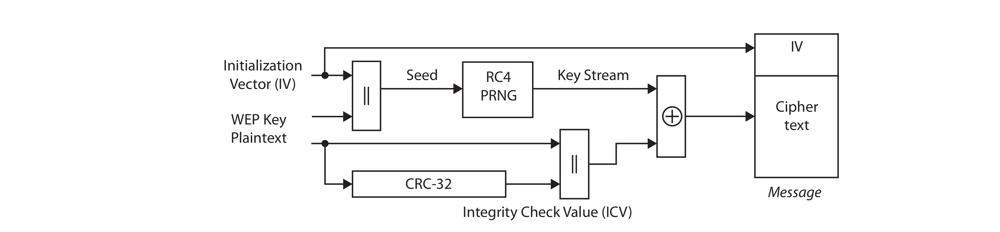
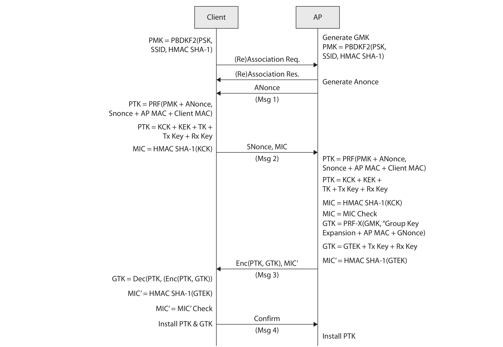

# Overview common Wi-Fi attacks

## Attack tree

```text
    1 Sniff Wi-Fi traffic (AND)
    2 Gain access (OR)
        2.1 Connect to unencrypted network (OR)
        2.2 Connect to encrypted wireless network
            2.2.1 WPS attack
                2.2.1.1 Break WEP encryption
                    2.2.1.1.1 FMS attack
                    2.2.1.1.2 Korek's chop-chop
                    2.2.1.1.3 PTW attack
                    2.2.1.1.4 Caffe Latte attack
                2.2.1.2 Break WPA encryption
                    2.2.1.2.1 Beck-Tews attack
                    2.2.1.2.2 Halvorsen-Haugen attack
                    2.2.1.2.3 Brute force PMK
            2.2.2 ARP/MAC spoofing (MitM)
    3 Denial of Service
        3.1 Jam radio signal
        3.2 Flood with broadcast of frames
        3.3 Disassociation/deauthentication attack
```

## Notes

### WEP

WEP was the standard before WPA. The WEP encryption process uses the RC4 stream cipher. RC4 is a symmetric key 
cipher used to expand a short key into an infinite pseudo-random keystream.

[](https://en.wikipedia.org/wiki/Wired_Equivalent_Privacy)

A number of flaws in the WEP algorithm seriously undermine the security claims of the system. Possible attacks
are:

* Passive attacks to decrypt traffic based on statistical analysis.
* Active attack to inject new traffic from unauthorised mobile stations, based on known plaintext.
* Active attacks to decrypt traffic, based on tricking the access point.
* Dictionary-building attack that, after analysis of about a day's worth of traffic, allows real-time automated 
decryption of all traffic. 

Key reuse in the encryption stream (24-bit IV) makes it vulnerable to cracking, as well as to fragmentation
and replay attacks. `aireplay-ng` can be used to generate IV samples and `aircrack-ng` to
[decipher the secret key](wep.md). You can also use [wifite](wifite.md) to conduct attacks against WEP.

### WPA and WPA2

WPA was introduced as an interim replacement for WEP and did not require
consumers to replace hardware to support the new security measure. Instead, most
vendors released software/firmware updates that could be installed on existing devices.
There are multiple flavors of WPA based on the 802.11i wireless security standard: WPA,
WPA2, and WPA3.

WPA increased from 63-bit and 128-bit encryption in WEP to 256-bit encryption
technology. WPA implemented the Temporal Key Integrity Protocol (TKIP) after WEP
encryption was broken. TKIP is symmetric encryption that still uses the same WEP
programming and RC4 encryption algorithm, but it encrypts each data packet with
a stronger and unique encryption key. It also includes some additional security algorithms 
made up of a cryptographic message integrity check, IV sequence mechanism that
includes hashing, a rekeying mechanism to ensure key generation after 10,000 packets,
and to increase cryptographic strength, it includes a per-packet key-mixing function.

These were designed to add protection against social engineering, replay and injection attacks, 
weak-key attacks, and forgery attempts.

WPA2 introduced the use of the Advanced Encryption Standard (AES) instead of TKIP. After 2006, all new devices
bearing the Wi-Fi trademark required mandatory WPA2 certification. WPA and WPA2 use a four-way handshake to establish 
connection.

[](https://www.wifi-professionals.com/2019/01/4-way-handshake)

## WPA3

Like WPA2, WPA3 uses AES and a four-way handshake. Its main difference with WPA2 is that it is designed for 
perfect-forward secrecy. This means that the encryption key changes such that its compromise will not result 
in a breach of data encrypted before that compromise took place. IOW, a privacy feature that prevents older data 
from being compromised by a later attack. 

Additionally, WPA3 uses Simultaneous
Authentication of Equals (SAE) in an attempt to solve WPA and WPA2’s vulnerability
to dictionary attacks. SAE is a type of key exchange also referred to as Dragonfly.

WPA3 is weak to [downgrade attacks](downgrade.md) and timing attacks. The [Dragonblood](dragonblood.md) vulnerabilities
target the Dragonfly key exchange.
