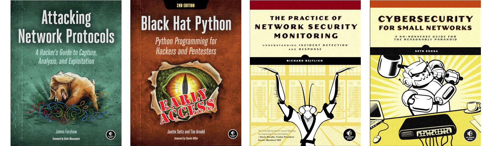

Riches in the ground
================================================

Aside from all of the resources to make and maintain the equipment, and the energy used to keep it all going on the physical level, on the other levels there is hardly any limit to the riches we can dig for, as its grounding principle seems to have been building new features upon new features for human convenience and (increasing) profit, with only some security and privacy concerns in mind. That seems to be improving, and in many cases security measures get tacked on. When one digs deep enough though ...

.. image:: _static/images/in-progress.png
  :alt: Forever in progress ...

----

.. toctree::
   :maxdepth: 1
   :includehidden:
   :caption: Testlab

   Virtual machines <https://red.tymyrddin.dev/projects/testlab/en/latest/docs/vm/README.html>
   Network tools <https://red.tymyrddin.dev/projects/testlab/en/latest/docs/network/README.html>
   Wireless tools <https://red.tymyrddin.dev/projects/testlab/en/latest/docs/wireless/README.html>

.. toctree::
   :maxdepth: 1
   :includehidden:
   :caption: Preparation

   Reconnaissance <https://red.tymyrddin.dev/projects/recon/en/latest/docs/scanning/README.html>
   Enumeration <https://red.tymyrddin.dev/projects/enum/en/latest/docs/system/README.html>

----

.. toctree::
   :maxdepth: 1
   :includehidden:
   :caption: Notes on techniques

   docs/notes/README.md
   docs/notes/manipulation.md
   docs/notes/intrusions.md
   docs/notes/barrages.md
   docs/notes/altercations.md
   docs/notes/incursions.md
   docs/notes/raids.md
   docs/notes/hacks.md
   docs/notes/skirmishes.md
   docs/notes/run-ins.md

----

.. toctree::
   :maxdepth: 1
   :includehidden:
   :caption: Network pentesting scripts

   MAC changer <https://github.com/tymyrddin/scripts-network/tree/master/mac_changer>
   ARP spoofer <https://github.com/tymyrddin/scripts-network/blob/master/arp_spoofer>
   File interceptor <https://github.com/tymyrddin/scripts-network/blob/master/file_interceptor>
   Code injector <https://github.com/tymyrddin/scripts-network/blob/master/code_injector>
   Client-server skeleton <https://github.com/tymyrddin/scripts-network/blob/master/client_server>
   Network scanner <https://github.com/tymyrddin/scripts-network/blob/master/network_scanner>
   DNS spoofer <https://github.com/tymyrddin/scripts-network/blob/master/dns_spoofer>
   Packet sniffer <https://github.com/tymyrddin/scripts-network/blob/master/packet_sniffer>
   Netcat replace <https://github.com/tymyrddin/scripts-network/blob/master/netcat_replace>
   Wireless <https://github.com/tymyrddin/scripts-network/blob/master/wireless>

----

.. toctree::
   :maxdepth: 1
   :includehidden:
   :caption: TryHackMe rooms

   docs/thm/README.md
   docs/thm/attacktive.md
   docs/thm/kerberos.md
   Mythical blue lake (scenario) <https://red.tymyrddin.dev/projects/ad/en/latest/>

----

.. toctree::
   :glob:
   :maxdepth: 1
   :includehidden:
   :caption: Root-me Network challenges

   docs/root-me/README.md
   docs/root-me/ftp-authentication.md
   docs/root-me/telnet-authentication.md
   docs/root-me/ethernet-frame.md
   docs/root-me/twitter-authentication.md
   docs/root-me/bl-unknown-file.md
   docs/root-me/cisco-password.md
   docs/root-me/zone-transfer.md
   docs/root-me/ip-ttl.md
   docs/root-me/ldap-null.md

----

